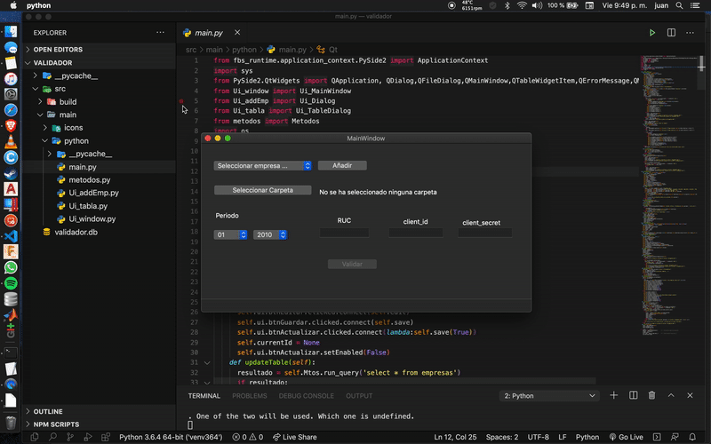
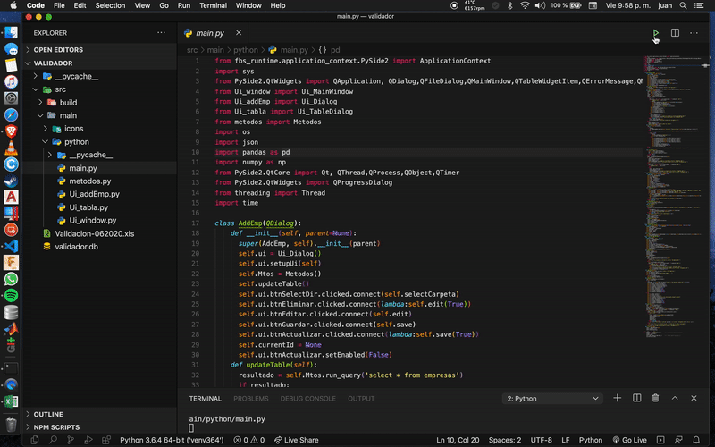

# Validador de comprobantes de pago con API SUNAT para archivos DBF
Validador de comprobantes de pago con lenguaje python y la librería [PySide2](https://pypi.org/project/PySide2/) para la interfaz de usuario. Todos los alineamientos se dan según la documentacion oficial de la 
[SUNAT](https://cpe.sunat.gob.pe/sites/default/files/inline-files/Manual-de-Consulta-Integrada-de-Comprobante-de-Pago-por-ServicioWEB_v2.pdf).

## Explicación

Este programa interactúa con la API de Sunat para comprobar la validez de comprobantes de pago registrados en un archivo 'dbf'.

## Importante

La estructura del archivo dbf deberá tener el nombre de 'tbregdatos.dbf' o se podrá modificar en el archivo con nombre 'main' y la estructura de la tabla deberá tener al menos los siguientes datos:
| RUC_EMPR | COD_OPER | SER_DOCU | NUM_DOCU | FCH_EMIS | IMP_MONA | IMP_MOEX | MES_ANO |
| :---: | :---: | :---: | :---: | :---: | :---: | :---: | :---: |
| Ruc | Código | Serie | Número | Fecha | Importe local | Importe extranjero | Mes y Año |

Estos datos son necesarios para obtener datos de la API Sunat 
([Documentación Oficial](https://cpe.sunat.gob.pe/sites/default/files/inline-files/Manual-de-Consulta-Integrada-de-Comprobante-de-Pago-por-ServicioWEB_v2.pdf)).

## Capacidades

### Selección de periodo y empresa para validación

### Exportación a excel

### Editar datos empresa

